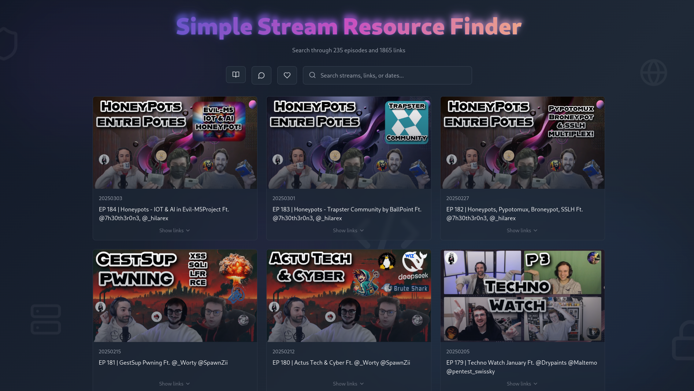

# Simple Stream Resource Finder

A minimalist web application to search and browse through stream resources.

> [https://linktr.ee/TheLaluka](https://linktr.ee/TheLaluka)



## Features

- 🔍 Real-time search through stream content
- 📱 Responsive design for mobile and desktop
- 🎨 Clean, modern UI with dark theme
- 🔗 Quick access to Discord and social links
- 📖 Stream guidelines and best practices

## Tech Stack

- React + TypeScript
- Tailwind CSS
- Lucide Icons
- GitHub Actions for CI/CD

## Development

```bash
# Install dependencies
npm install

# Populate the database
npm run populate

# Start development server
npm run dev

# Build for production
npm run build

# Audit & fix
npm audit fix
```

